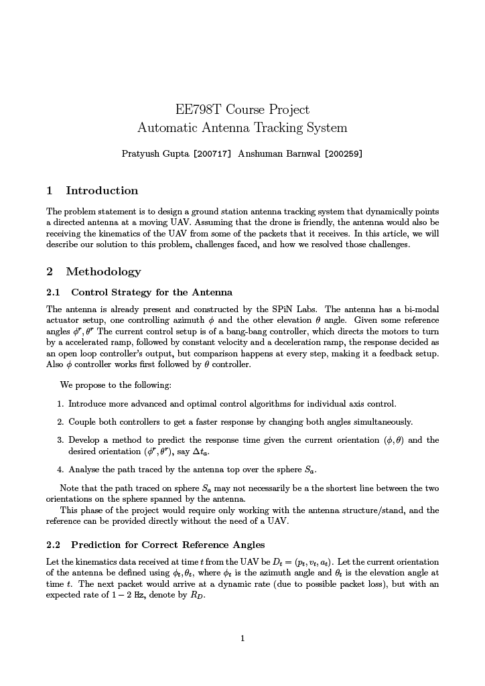
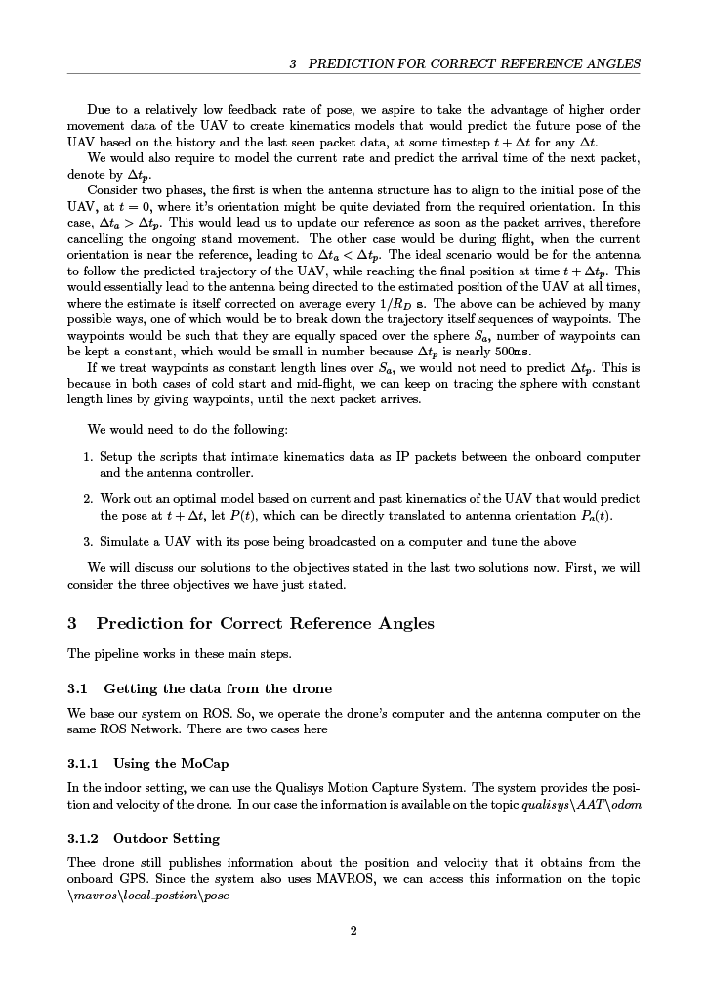
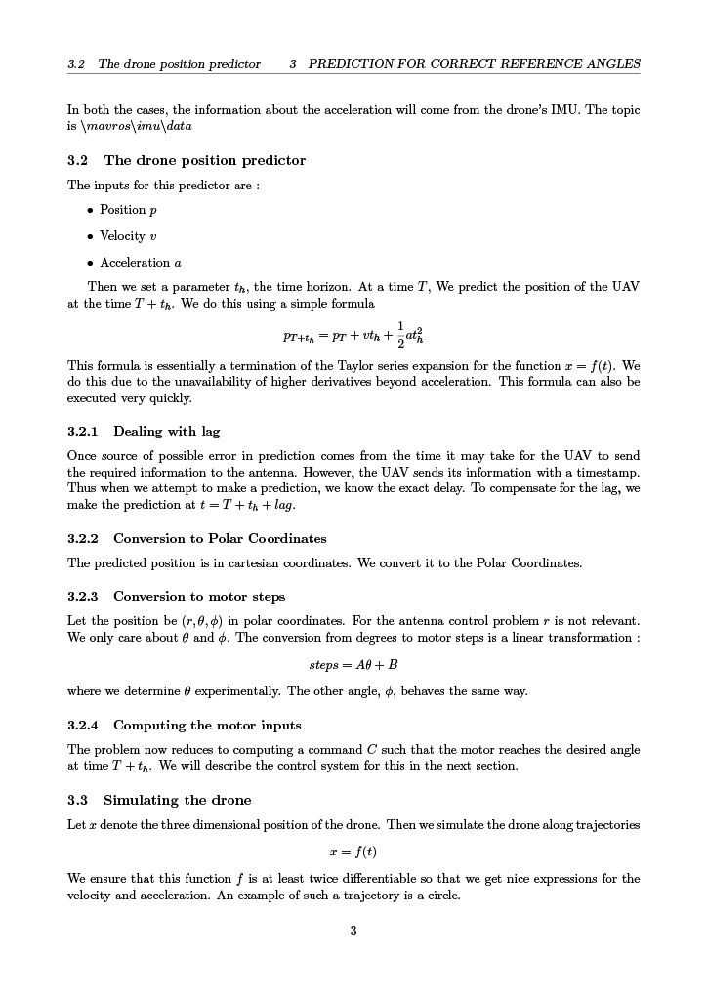

# Automatic Antenna Tracker
## Setup Instructions 
First clone the repository, then run the following command.
```bash
./install_tic.sh
```

## Build

Entire project is in the `workspace` folder. 
Ensure you have ROS Noetic Full installed, and have Python3.8

```
cd workspace
catkin init

catkin build
```

## Run

Correct configuration parameters from [here](./workspace/src/messages/config/).

## Running Instructions

First we need to connect to the SpiNLabs network to connect to the motion capture system. This step is not essential, but is necessary to monitor performance. To do so we got the file 

```/.bashrc```

and change the ROSMASTER url to the Qualisys system. This will allow us to access the MoCap data. 

Then we need to launch the initialization node. This will calibrate the elevation motor. To ldo this, run the following command 

```roslaunch initialization initialization.launch```

Next, we run the tracker on a simulated UAV. To start this run the following command

```roslaunch antenna_control motors.launch```

Alongside this, we would also like to monitor the perofrmance of the antenna. So run the following command

```rosrun antenna_control antenna_pose_node```

This node brings the current orientation of the antenna from the MoCap. To plot these, perform the following steps

First, run the command ```rqt_plot```

The current position of the simulated drone is being published on the topics ```current/pose/theta``` and ```current/pose/phi```

The actual position of the antenna is coming on the topic ```aantenna/pose```

By plotting these two together, we can asses the performance of the tracker. 

A brief overview of the results is presented here. 
### For an Unloaded motor
In both the pictures that follow, the blue line represents the motor angle, while the red line represents the angle the motor is supposed to be at.

Here is how the results look for our control system


When we remove our control system and predictor, the results look like

As we can see, our control system vastly reduces the lag in tracking. In fact, the tracker is running almost in real time.

### In actual run


A few ket observations can be made here. Initially the antenna was very far from the actual orientation, observe how quickly it catches up. The loaded motor struggles to catch up with quick changes in angle. We are looking into this issue as of now.

### A formal documentation is presented here






