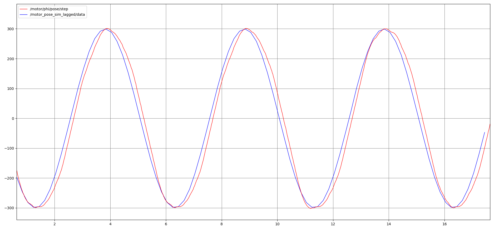
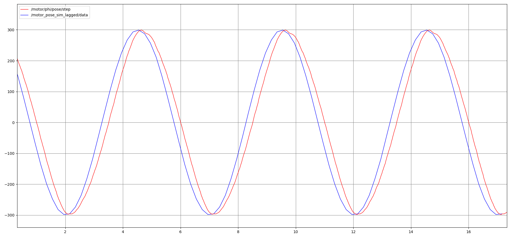
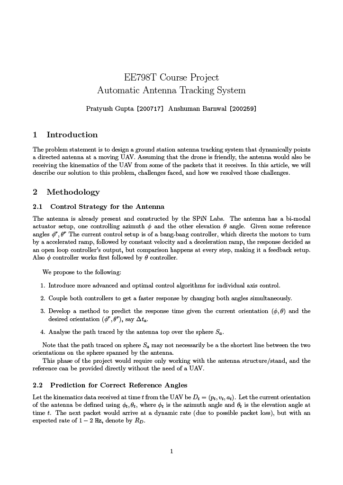
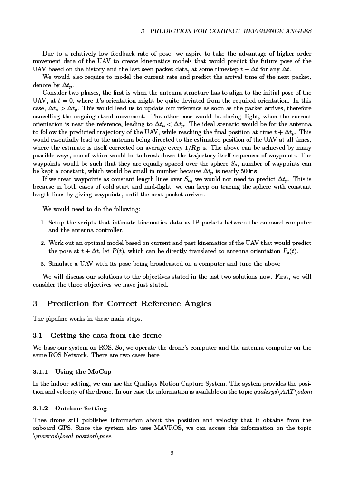
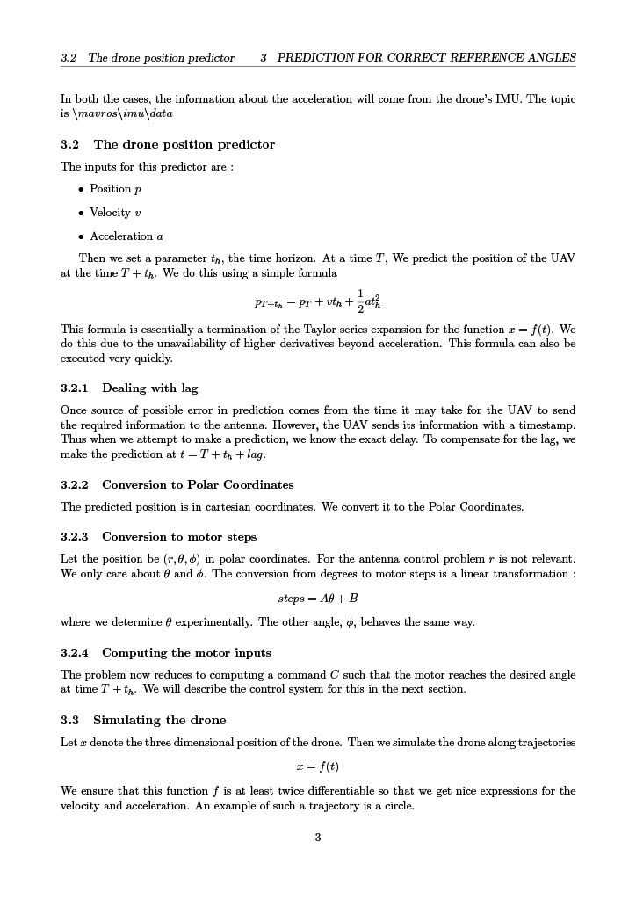

# Automatic Antenna Tracker
## Setup Instructions 
First clone the repository, then run the following command.
```bash
./install_tic.sh
```

## Build

Entire project is in the `workspace` folder. 
Ensure you have ROS Noetic Full installed, and have Python3.8

```
cd workspace
catkin init

catkin build
```

## Run

Correct configuration parameters from [here](./workspace/src/messages/config/).

## Running Instructions

For connecting to the SpiNLabs network's motion capture system. `export ROS_MASTER_URI` with the url of the Qualisys system. 
This will allow us to access the MoCap data. This step is not essential, but is necessary to monitor performance. 

Launch the initialization node. This will calibrate the elevation motor.

```
roslaunch initialization initialization.launch
```

Run the tracker on a simulated UAV. To start this run the following command

```
roslaunch antenna_control motors.launch
```

Alongside this, to monitor the performance of the antenna.

```
roslaunch antenna_control mocap.launch
```

This node brings the current orientation of the antenna from the MoCap. To plot these, perform the following steps

```
rqt_plot
```

The current position of the simulated drone is being published on the topics `current/pose/theta` and `current/pose/phi`

The actual position of the antenna is coming on the topic `antenna/pose`

By plotting these two together, we can measure the performance of the tracker. 

A brief overview of the results is presented here.

### For an Unloaded motor

In both the pictures that follow, the blue line represents the motor angle, while the red line represents the angle the motor is supposed to be at.

Here is how the results look for our control system


When we remove our control system and predictor, the results look like

As we can see, our control system vastly reduces the lag in tracking. In fact, the tracker is running almost in real time.

### In actual run


A few ket observations can be made here. Initially the antenna was very far from the actual orientation, observe how quickly it catches up. The loaded motor struggles to catch up with quick changes in angle.

### A formal documentation is presented here

Find the updated presentation [here](https://docs.google.com/presentation/d/1YtQEjM-GGr2cSN8wPf0b66ktrHt0fHe1mSLf-k5kZsU/edit?usp=sharing).

<!-- 


 -->
